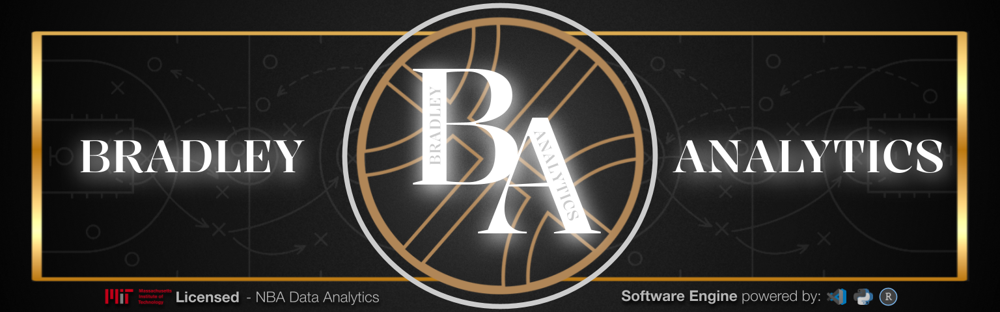
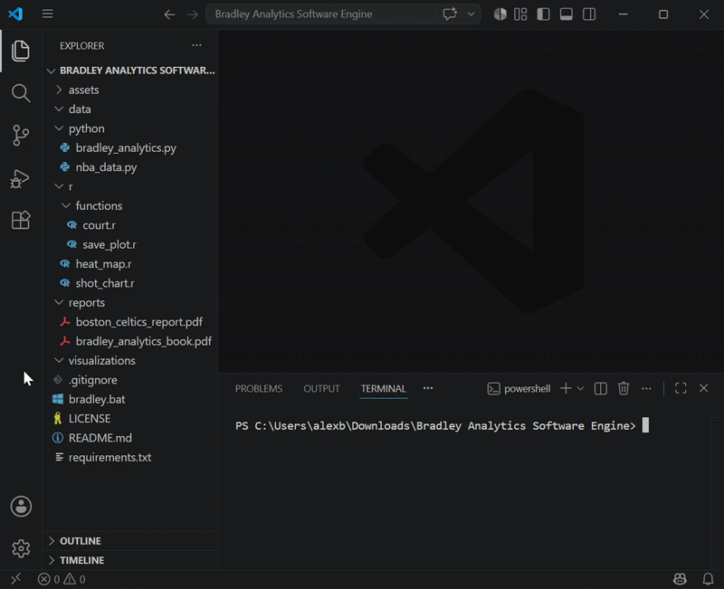
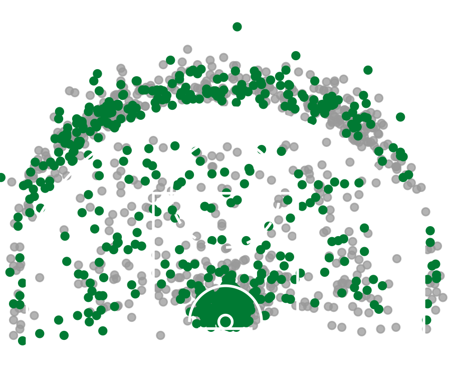
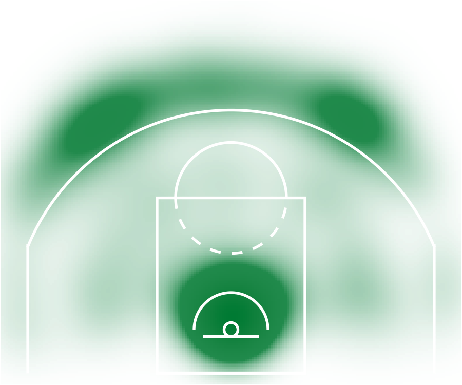
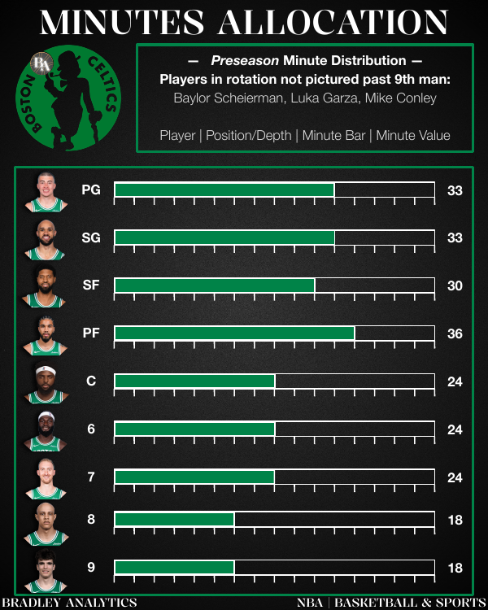
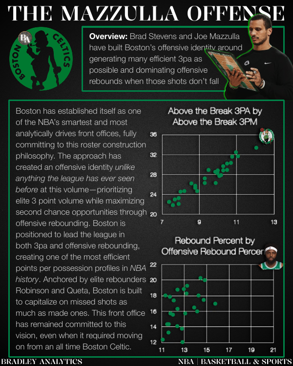

<h1 align="center">
Bradley Analytics Software Engine
</h1>

<p align="center">

</p>


## Table of Contents

- [Why This Matters](#why-this-matters)
- [Overview](#overview)
- [Quick Start](#quick-start)
- [Features](#features)
- [Demo & Visualizations](#demo--visualizations)
- [How It Works](#how-it-works)
- [Technologies Used](#technologies-used)
- [Project Structure](#project-structure)
- [Installation](#installation)
- [Usage](#usage)
- [Example Output](#example-output)
- [Results: Boston Celtics Report](#results-boston-celtics-report)
- [Future Improvements](#future-improvements)
- [Troubleshooting](#troubleshooting)
- [Author](#author)
- [License](#license)

---

# Why This Matters

NBA front offices, scouts, and the meadia rely on shot charts and shooting heat maps to evaluate player tendencies, spot strengths and weaknesses, and communicate performance in a way raw stat lines can't. The Bradley Analytics Software Engine automates that process end to end, turning a player name and season into a publication ready visualization in seconds instead of hours of manual data pulling and plotting.

This project demonstrates a complete analytics pipeline: pulling live data from an external API, cleaning and structuring it, and rendering it into a polished visual product. It's the same core workflow used in real sports analytics and business intelligence roles.

# Overview

The Bradley Analytics Software Engine is an NBA basketball analytics application that transforms raw player shooting data into professional quality basketball visualizations.

Built using Python, R, and NBA API data, this software engine allows users to select an NBA player, season, and visualization type to automatically generate customized transparent shot charts and shooting heat maps.

The goal of this project is to combine data engineering, statistical visualization, and basketball storytelling into a simple analytics tool that converts complex NBA datasets into clear and meaningful insights.

This project is part of my basketball analytics portfolio, where I explore how data can be used to better understand player performance, team strategy, and decision making in professional sports.

Portfolio:  
[Bradley Analytics Instagram](https://www.instagram.com/bradleyanalytics/)

---

# Quick Start

For anyone who wants to get up and running immediately:

```bash
git clone https://github.com/alexbrxdley/Bradley-Analytics-Software-Engine.git
cd "Bradley Analytics Software Engine"
pip install -r requirements.txt
```

Then open R and install the visualization packages:

```r
install.packages("tidyverse")
install.packages("ggplot2")
```

Run the engine:

**Windows:**

```bash
.\bradley.bat
```

**Mac:**

```bash
python3 python/bradley_analytics.py
```

See [Installation](#installation) and [Usage](#usage) below for full setup details and an example walkthrough.

---

# Features

## Automated NBA Data Collection

- Retrieves player shooting data directly from the NBA API
- Searches NBA players and available seasons automatically
- Processes player shot locations for analysis

## Shot Chart Generation

Creates customized shot charts displaying:

- Made and missed shots
- NBA court dimensions
- Player shooting locations
- Team specific color customization

## Shooting Heat Maps

Creates density based heat maps that visualize:

- High volume shooting areas
- Shot distribution tendencies
- Offensive strengths and weaknesses
- Team specific color customization

## Automated Visualization Pipeline

The engine manages the complete workflow:

1. User input
2. NBA data retrieval
3. Data processing
4. Visualization generation
5. Output creation

---

# Demo & Visualizations



## Shot Chart Example



## Heat Map Example



Generated visualizations are automatically saved into:

```
visualizations/
```

Additional basketball analytics reports and presentations can be found in:

```
reports/
```

---

# How It Works

## Architecture Diagram

```
           User Input
                |
                v
+-------------------------------+
| Bradley Analytics Engine      |
| Python Application            |
+-------------------------------+
                |
                v
     NBA API Data Retrieval
                |
                v
+-------------------------------+
| Data Processing               |
| pandas + CSV Storage          |
+-------------------------------+
                |
                v
        Player Shot Data
                |
                v
+-------------------------------+
| R Visualization Engine        |
| ggplot2 + Custom NBA Court    |
+-------------------------------+
                |
                v
+-------------------------------+
| Generated Visualizations      |
| Shot Charts + Heat Maps       |
+-------------------------------+
```

## Workflow

```
1. User selects NBA player and season
                |
                v
2. Python retrieves NBA shooting data
                |
                v
3. Data is cleaned and organized
                |
                v
4. R creates basketball visualizations
                |
                v
5. Final PNG files are saved
```

---

# Technologies Used

## Programming Languages

- Python
- R

## Data Collection

- NBA API
- pandas

## Visualization

- ggplot2
- tidyverse

## Development Tools

- Visual Studio Code
- Git/GitHub

## Analytics Skills Applied

- Data collection
- Data cleaning
- Statistical visualization
- Sports analytics storytelling
- Basketball performance analysis

---

# Project Structure

```
Bradley Analytics Software Engine/

│
├── data/
│   └── Generated NBA datasets
│
├── visualizations/
│   └── Generated shot charts and heat maps
│
├── python/
│   ├── bradley_analytics.py
│   └── nba_data.py
│
├── r/
│   ├── shot_chart.r
│   ├── heat_map.r
│   └── functions/
│       ├── court.r
│       └── save_plot.r
|
├── reports/
│   └── Bradley Analytics reports
│
├── assets/
│   └── README images and banner
|
├── README.md
├── LICENSE
├── requirements.txt
└── bradley.bat
```

---

# Installation

## Clone the Repository

```bash
git clone https://github.com/alexbrxdley/Bradley-Analytics-Software-Engine.git
```

Navigate into the project folder:

```bash
cd "Bradley Analytics Software Engine"
```

## Install Python Dependencies

```bash
pip install -r requirements.txt
```

## Install Required R Packages

The visualization engine uses R for generating shot charts and heat maps. Make sure R is installed locally before running the software.

Open R and install the required packages:

```r
install.packages("tidyverse")
install.packages("ggplot2")
```

---

# Usage

Launch the Bradley Analytics Software Engine:

**Windows:**

```bash
.\bradley.bat
```

**Mac:**

```bash
python3 python/bradley_analytics.py
```

The engine will guide you through:

1. Entering an NBA player
2. Selecting a season
3. Choosing a visualization
4. Selecting a team color

Example:

```
Enter player name: Jayson Tatum

Available Seasons:

1. 2017-18
2. 2018-19
3. 2019-20
4. 2020-21
5. 2021-22
6. 2022-23
7. 2023-24
8. 2024-25
9. 2025-26

Choose season: 7

Available Visualizations:
1. Shot Chart
2. Heat Map

Choose visualization: 1

Enter team name: Celtics
```

The engine will automatically:

- Retrieve NBA shooting data using the NBA API
- Process player shot locations
- Generate the selected visualization using Python and R
- Save the final PNG file

Generated visualizations are saved in:

```
visualizations/
```

---

# Example Output

Example generated files:

```
visualizations/

jayson-tatum_2023-24_shot-chart.png

jayson-tatum_2023-24_heat-map.png
```

These visualizations can be used for:

- Player evaluation
- Scouting reports
- Social media analytics
- Basketball strategy discussions

---

# Results: Boston Celtics Report

One application of the Bradley Analytics Software Engine was the Bradley Analytics Boston Celtics Report July 2026 that was focused on using shot charts to evaluate player tendencies.

The analysis demonstrated how basketball visualizations can help:

- Identify offensive patterns
- Evaluate shot selection
- Communicate player strengths and weaknesses
- Translate NBA data into strategic insights







The complete Bradley Analytics Boston Celtics Report is available in the `reports/` folder.

[The Bradley Analytics Book](https://docs.google.com/presentation/d/10oVZkR50QBvXiob5jMWr9oYAMjl61txyJMO19qY-wac/edit?usp=sharing)

---

# Future Improvements

Future versions of the Bradley Analytics Software Engine will expand functionality through:

## Additional Visualizations

- More unique shot charts
- Shot profile radars and zone maps
- Defensive charts
- Team charts
- Player comparison visualizations
- Visualizations paired with different stats

## Interactive Features

- Animated versions of every visualization
- Interactive Plotly shot charts
- Streamlit analytics dashboard
- Web based player analysis interface
- Lineup analysis
- Player comparison tool
- Draft comparison model
- Trade machine
- Raw data explorer

## Advanced Analytics

- New invented and self created stats and calculations:
- Bradley Shot Index (a proprietary shot value metric)
- Bradley 3PT Shooting Index (combining 3PA/36/100, 3P%, and shot difficulty into one score)
- Bradley 3PT Efficiency Scatter Plot (3PA/36/100 vs. 3P%)
- Bradley Space Rating (3PA, 3P%, catch and shoot, and movement shooting)
- Bradley Offensive Gravity (measuring how a player's shot profile stretches the defense)
- Bradley Shot Quality Rating
- Bradley Offensive Threat Score
- Bradley Perimeter Defense Index (radar chart: opponent FG%, deflections, loose balls, steals, screen navigation, charges)
- Bradley Interior Defense Index (bar chart: opponent rim FG%, blocks, contested shots, paint defense)
- Bradley Versatility Defense Index (measuring defense against each position)
- Bradley Defense Radar (steals, blocks, deflections, charges, rim protection, isolation defense, switchability)
- Bradley Archetype Identifier (weighing shooting, defense, rebounding, and other skills into a player type)
- Bradley Archetype Quadrant (a visual map of shooters, defenders, and 3&D players)
- Bradley Team Fit Calculator (input a player and team/coach, output spacing fit, defensive fit, rebounding fit, transition fit, and an overall fit score)
- Bradley Impact per Dollar (player rating plotted against salary)

## Deployment

- GitHub Pages portfolio website
- Interactive dashboards
- Public live demo
- Cloud hosted analytics application

---

# Troubleshooting

## "Player not found"

Double check the spelling of the player's full name ("Jayson Tatum" not "J. Tatum" or a nickname). The lookup matches against the NBA's official player database, so only full, correctly spelled names will return a result.

## NBA API errors or timeouts

The engine pulls live data from the NBA API on every run. A failed request usually means the internet connection dropped or NBA.com is temporarily rate limiting requests. Wait a moment and try again.

## "Could not find Rscript" or R-related errors

Make sure R is installed and that `Rscript` is available from the command line (this works the same way on Windows and Mac). If you just installed R, restart your terminal so it picks up the updated PATH.

## Required R packages are missing

Open R and run:

```r
install.packages("tidyverse")
install.packages("ggplot2")
```

## bradley.bat won't run

`bradley.bat` is a Windows batch file, so it only runs on Windows. On Mac, run the Python script directly instead:

```bash
python3 python/bradley_analytics.py
```

## Visualization didn't save or file not found

Confirm you're looking in the `visualizations/` folder, and that the data retrieval and R visualization steps both completed without printing an error message.

---

# Author

## Alex Bradley

Back Bay, Boston, Massachusetts

Master of Science in Business Data Analytics (Candidate 2026)
University of Massachusetts Amherst

Bachelor of Science in Sport Management (2025)
University of Massachusetts Amherst

Bradley Analytics combines my passion for basketball, data analytics, and visual storytelling by creating visualization tools that transform NBA data into meaningful insights.

## Links

[LinkedIn](https://www.linkedin.com/in/alexandergmbradley/)

[Instagram Portfolio](https://www.instagram.com/bradleyanalytics/)

[Bradley Analytics Book](https://docs.google.com/presentation/d/10oVZkR50QBvXiob5jMWr9oYAMjl61txyJMO19qY-wac/edit?usp=sharing)

## Contact

Email:  
alexbrxdley@gmail.com

Phone:  
(617) 651-2003

---

# License

This project is licensed under the MIT License.
