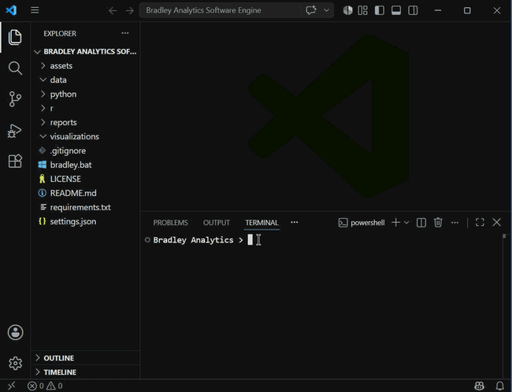
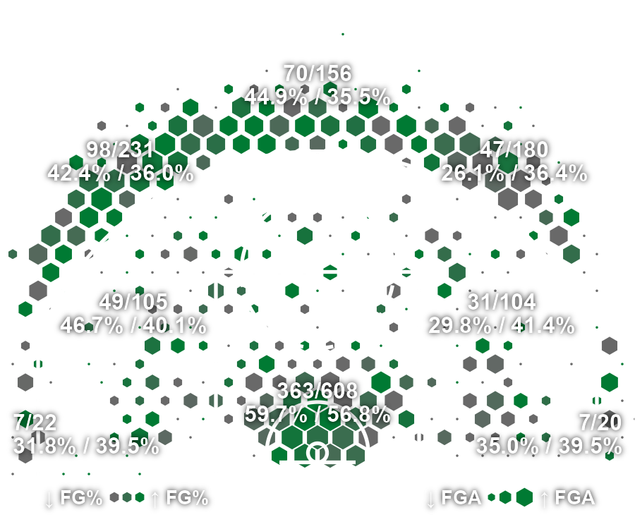
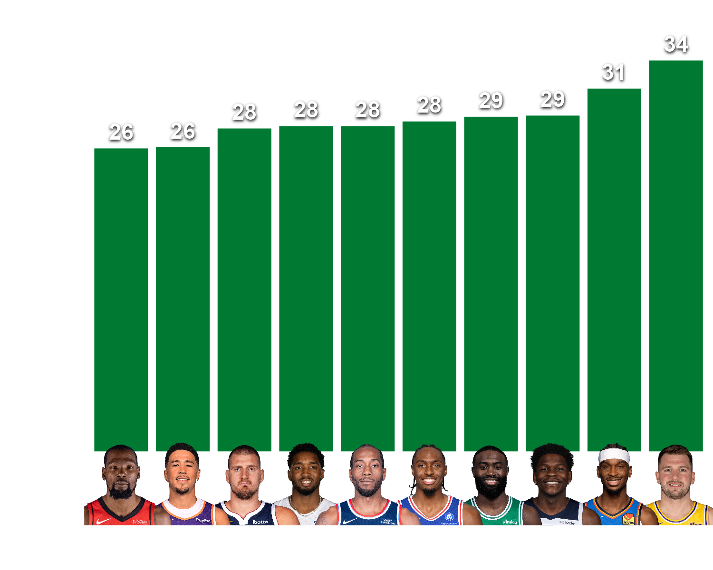
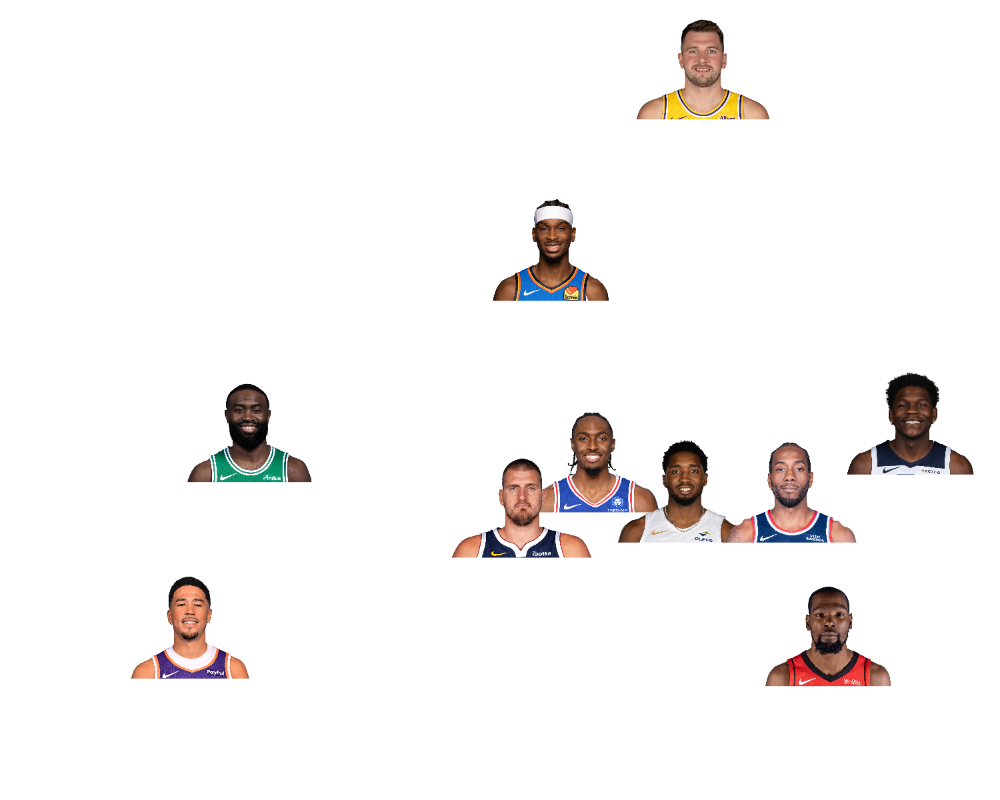
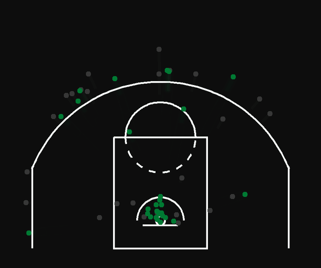

<h1 align="center">
Bradley Analytics Software Engine
</h1>

<p align="center">

</p>


<p align="center">
<a href="https://alexbrxdley.github.io/Bradley-Analytics-Software-Engine/"><strong>Live marketing site</strong></a>
&nbsp;&middot;&nbsp;
<a href="https://bradleyanalytics.streamlit.app"><strong>Live interactive dashboard</strong></a>
</p>

## Table of Contents

- [Overview](#overview)
- [Features](#features)
- [Demo & Visualizations](#demo--visualizations)
- [How It Works](#how-it-works)
- [Technologies Used](#technologies-used)
- [Project Structure](#project-structure)
- [Installation](#installation)
- [Usage](#usage)
- [Customization](#customization)
- [Example Output](#example-output)
- [Results: Boston Celtics Report](#results-boston-celtics-report)
- [Future Improvements](#future-improvements)
- [Troubleshooting](#troubleshooting)
- [Author](#author)
- [License](#license)

---

# Overview

The Bradley Analytics Software Engine is an NBA basketball analytics application that transforms raw player shooting data into professional quality basketball visualizations.

Built using Python, R, and NBA API data, this software engine lets users search by player or team, then generate court-based shot charts, stat-driven leaderboards and scatter plots (including Bradley Analytics' own invented player ratings), all rendered as polished, transparent, publication-ready visualizations.

The goal of this project is to combine data engineering, statistical visualization, and basketball storytelling into a simple analytics tool that converts complex NBA datasets into clear and meaningful insights.

This project is part of my basketball analytics portfolio, where I explore how data can be used to better understand player performance, team strategy, and decision making in professional sports.

## Why This Matters

NBA front offices, scouts, and media rely on visualizations like these to evaluate player tendencies and communicate performance in ways raw stat lines can't. This project demonstrates that same end-to-end analytics pipeline, from live API data through to a polished visual product, the same core workflow used in real sports analytics and business intelligence roles.

Portfolio:  
[Bradley Analytics Instagram](https://www.instagram.com/bradleyanalytics/)

---

# Features

## Automated NBA Data Collection

- Retrieves player shooting data directly from the NBA API
- Searches NBA players and available seasons automatically
- Processes player shot locations for analysis

## Shot Chart Generation

Creates customized shot charts displaying:

- Made and missed shots
- NBA court dimensions
- Player shooting locations
- Team specific color customization

## Shooting Heat Maps

Creates density based heat maps that visualize:

- High volume shooting areas
- Shot distribution tendencies
- Offensive strengths and weaknesses
- Team specific color customization

## Hex Shot Chart Generation

Creates hexagonal shot charts displaying:

- Shot frequency by hex size
- Shooting efficiency relative to league average by hex opacity
- Zone-by-zone breakdown with FGM/FGA and FG% vs. league FG%
- Team specific color customization

## Bar Chart Generation

Creates leaderboard-style bar charts displaying:

- Top N players or teams by any stat
- Player headshots or team logos in place of axis labels
- The value shown directly above each bar
- Vertical or horizontal orientation
- Team specific color customization

## Scatter Plot Generation

Creates two-stat comparison scatter plots displaying:

- Any two stats plotted against each other (Y axis vs. X axis)
- Player headshots or team logos in place of plot points
- Manually-included players or teams shown larger, so specific comparisons stand out
- Percentage-aware axis formatting on either axis independently

## Animated Shot Chart Generation

Creates an animated GIF of a player's or team's shots, revealed in true chronological game order:

- Made shots glow in team color and persist on screen permanently
- Missed shots draw in grey, hold briefly, then fade out and disappear
- A fixed-length GIF (default 15 seconds) regardless of shot volume, a full season's worth of shots reveal in batches to stay within that runtime
- Stylized curved shot trails, birds-eye view, matching the same court used by every other visualization

## Bradley Analytics Invented Stats

Custom 0-100 composite ratings, built from real NBA data rather than reverse-engineered from anything else, available as a stat source in both Bar Chart and Scatter Plot:

- **Bradley 3-Point Shooting Rating:** blends 3P% and 3-point volume (both weighted), combined across the current season and recent history, with smooth (not stepped) adjustments for one-off bad seasons and long-term shooting consistency
- Full formula and reasoning shown directly in the terminal stat picker
- More Bradley-invented ratings planned (see [Future Improvements](#future-improvements))

## Automated Visualization Pipeline

The engine manages the complete workflow:

1. User input
2. NBA data retrieval
3. Data processing
4. Visualization generation
5. Output creation

---

# Demo & Visualizations



## Shot Chart Example


## Heat Map Example


## Hex Shot Chart Example



## Bar Chart Example



## Scatter Plot Example



## Animated Shot Chart Example



Generated visualizations are automatically saved into:

```
visualizations/
```

Additional basketball analytics reports and presentations can be found in:

```
reports/
```

---

# How It Works

## Architecture Diagram

```
           User Input
                |
                v
+-------------------------------+
| Bradley Analytics Engine      |
| Python Application            |
+-------------------------------+
                |
                v
     NBA API Data Retrieval
                |
                v
+-------------------------------+
| Data Processing               |
| pandas + CSV Storage          |
+-------------------------------+
                |
                v
   Shot Data  or  Stat Leaderboard
   (court graphs)  (Bar Chart / Scatter Plot,
                    including Bradley Analytics'
                    own invented ratings)
                |
                v
+-------------------------------+
| R Visualization Engine        |
| ggplot2 + Custom NBA Court    |
+-------------------------------+
                |
                v
+-------------------------------+
| Generated Visualizations      |
+-------------------------------+
```

## Workflow

```
1. User searches by player or team
                |
                v
2. User chooses a visualization
                |
                v
3. Python retrieves NBA data
   (shot-level data for court graphs,
    season leaderboards for Bar Chart/Scatter Plot)
                |
                v
4. Data is cleaned and organized
                |
                v
5. R creates the visualization
                |
                v
6. Final PNG (or GIF, for Animated Shot Chart) is saved
```

---

# Technologies Used

## Programming Languages

- Python
- R

## Data Collection

- NBA API
- pandas

## Visualization

- ggplot2
- tidyverse
- hexbin
- ggfx
- ggimage
- scales
- jsonlite
- gifski

## Development Tools

- Visual Studio Code
- Git/GitHub

## Analytics Skills Applied

- Data collection
- Data cleaning
- Statistical visualization
- Sports analytics storytelling
- Basketball performance analysis

---

# Project Structure

```
Bradley Analytics Software Engine/

│
├── data/
│   └── Generated NBA datasets
│
├── visualizations/
│   └── Generated visualizations
│
├── python/
│   ├── bradley_analytics.py
│   ├── nba_data.py
│   ├── axis_data.py
│   ├── scatter_data.py
│   └── bradley_ratings.py
│
├── r/
│   ├── shot_chart.r
│   ├── heat_map.r
│   ├── hex_shot_chart.r
│   ├── animated_shot_chart.r
│   ├── bar_chart.r
│   ├── scatter_plot.r
│   └── functions/
│       ├── court.r
│       └── save_plot.r
|
├── reports/
│   └── Bradley Analytics reports
│
├── assets/
│   └── README images/GIFs
|
├── docs/
│   ├── index.html
│   ├── overview.md
│   ├── visualizations.md
│   ├── installation.md
│   ├── results.md
│   ├── future-improvements.md
│   ├── author.md
│   ├── site.css
│   ├── _config.yml
│   ├── _includes/
│   ├── _layouts/
│   ├── assets/ (copy of root assets/, needed since GitHub Pages serves docs/ as the site root)
│   └── favicon files
|
├── README.md
├── LICENSE
├── requirements.txt
├── settings.json
└── bradley.bat
```

---

# Installation

## Clone the Repository

```bash
git clone https://github.com/alexbrxdley/Bradley-Analytics-Software-Engine.git
```

Navigate into the project folder:

```bash
cd "Bradley Analytics Software Engine"
```

## Install Python Dependencies

```bash
pip install -r requirements.txt
```

## Install Required R Packages

The engine uses R for generating visualizations. Make sure R is installed locally before running the software.

Open R and install the required packages:

```r
install.packages("tidyverse")
install.packages("ggplot2")
install.packages("hexbin")
install.packages("ggfx")
install.packages("ggimage")
install.packages("scales")
install.packages("jsonlite")
install.packages("gifski")
```

---

# Usage

Launch the Bradley Analytics Software Engine:

**Windows:**

```bash
.\bradley.bat
```

**Mac:**

```bash
python3 python/bradley_analytics.py
```

The engine will guide you through:

1. Searching by player or team
2. Choosing a visualization (Court Graphs, Axis Graphs, or Animated)
3. Court Graphs and Animated: entering a player/team and season
   Bar Chart: choosing a stat, how many to show, season, and orientation
   Scatter Plot: choosing two stats (Y axis, then X axis), how many to show, and season
4. Selecting an accent color (team name or a color code), every visualization except Scatter Plot, which shows no color at all (images only)

Shot Chart Example:

```
Search by player, team or criteria
1. Player
2. Team
3. Criteria

Choose an option: 1

Available Visualizations

Court Graphs:
1. Shot Chart
2. Heat Map
3. Hex Shot Chart

Axis Graphs:
4. Bar Chart
5. Scatter Plot

Animated:
6. Animated Shot Chart

Choose visualization: 1

Enter player name: Jayson Tatum

Available Seasons

1. 2017-18
2. 2018-19
3. 2019-20
4. 2020-21
5. 2021-22
6. 2022-23
7. 2023-24
8. 2024-25
9. 2025-26

Choose season: 9

For visualization color, enter team name or a color code: Celtics

Accent color: #007A33
```

Bar Chart (option 4) follows a different order after it's selected: it asks for a stat, how many entities to show, season, and orientation, before finishing with the same accent color prompt.

Scatter Plot (option 5) follows a different order too: it asks for a first stat (Y axis), then a second stat (X axis), how many entities to show, and season, with no orientation and no color prompt at all (the chart uses player headshots or team logos, not a colored fill). Both stat prompts share the same categorized picker, with Bradley Analytics' own invented ratings listed first.

Animated Shot Chart (option 6) follows the exact same player/team and season flow as the Court Graphs above, just kept in its own category so it's not confused with the static charts.

The engine will automatically:

- Retrieve NBA data using the NBA API
- Process it for the selected visualization
- Generate the chart using Python and R
- Save the final PNG file (or GIF, for Animated Shot Chart)

Generated visualizations are saved in:

```
visualizations/
```

---

# Customization

Every tunable value across every visualization: colors, sizes, shadow effects, minimum-attempts qualifiers, and more, all live in one file at the project root:

```
settings.json
```

Open it in any text editor, change a value, save, and run the engine again, no code changes needed. Settings are grouped by which visualization they affect (`shot_chart`, `heat_map`, `hex_shot_chart`, `animated_shot_chart`, `bar_chart`, `scatter_plot`), plus `bradley_ratings` for the formula behind every Bradley Analytics invented stat, and shared sections for colors, output dimensions, and data-fetching behavior (like `min_games_played`, which filters out small-sample-size players from Bar Chart and Scatter Plot leaderboards).

---

# Example Output

Example generated files:

```
visualizations/

jayson-tatum_2023-24_shot-chart.png
jayson-tatum_2023-24_heat-map-chart.png
jayson-tatum_2023-24_hex-shot-chart.png
top-10-bradley_3pt_rating_2025-26_bar-chart.png
top-10-bradley_3pt_rating-vs-3pa_2025-26_scatter-plot.png
jayson-tatum_2023-24_animated-shot-chart.gif
```

These visualizations can be used for:

- Player evaluation
- Scouting reports
- Social media analytics
- Basketball strategy discussions

---

# Results: Boston Celtics Report

One application of the Bradley Analytics Software Engine was the Bradley Analytics Boston Celtics Report July 2026 that was focused on using shot charts to evaluate player tendencies.

The analysis demonstrated how basketball visualizations can help:

- Identify offensive patterns
- Evaluate shot selection
- Communicate player strengths and weaknesses
- Translate NBA data into strategic insights

<details>
<summary><strong>1. Front Cover</strong></summary>
<br>


</details>

<details>
<summary><strong>2. Jaylen Brown Trade: Cap Flexibility</strong></summary>
<br>


</details>

<details>
<summary><strong>3. Jaylen Brown Trade: Net Rating Impact</strong></summary>
<br>


</details>

<details>
<summary><strong>4. Jaylen Brown Trade: Shot Chart Comparison</strong></summary>
<br>


</details>

<details>
<summary><strong>5. Offseason Overview</strong></summary>
<br>


</details>

<details>
<summary><strong>6. Minutes Allocation</strong></summary>
<br>


</details>

<details>
<summary><strong>7. The Mazzulla Offense</strong></summary>
<br>


</details>

<details>
<summary><strong>8. TPE Trade Scenario: Ty Jerome</strong></summary>
<br>


</details>

<details>
<summary><strong>9. More $20M TPE Trades</strong></summary>
<br>


</details>

<details>
<summary><strong>10. Back Cover</strong></summary>
<br>


</details>

<br>

The complete Bradley Analytics Boston Celtics Report is available in the `reports/` folder.

[The Bradley Analytics Book](https://docs.google.com/presentation/d/10oVZkR50QBvXiob5jMWr9oYAMjl61txyJMO19qY-wac/edit?usp=sharing)

---

# Future Improvements

Future versions of the Bradley Analytics Software Engine will expand functionality through:

## Additional Visualizations

- More unique shot charts
- Shot profile radars and zone maps
- Defensive charts

## Interactive Features

- Animated versions of the remaining visualizations (Animated Shot Chart is already built: [Animated Shot Chart Generation](#animated-shot-chart-generation))
- Interactive Plotly shot charts
- Lineup analysis
- Player comparison tool
- Draft comparison model
- Trade machine
- Raw data explorer

## Advanced Analytics

New invented and self created stats and calculations, the first, Bradley 3-Point Shooting Rating, is already built (see [Bradley Analytics Invented Stats](#bradley-analytics-invented-stats)). Planned next:

- Bradley Shot Index (a proprietary shot value metric)
- Bradley Space Rating (3PA, 3P%, catch and shoot, and movement shooting)
- Bradley Offensive Gravity (measuring how a player's shot profile stretches the defense)
- Bradley Shot Quality Rating
- Bradley Offensive Threat Score
- Bradley Perimeter Defense Index (radar chart: opponent FG%, deflections, loose balls, steals, screen navigation, charges)
- Bradley Interior Defense Index (bar chart: opponent rim FG%, blocks, contested shots, paint defense)
- Bradley Versatility Defense Index (measuring defense against each position)
- Bradley Defense Radar (steals, blocks, deflections, charges, rim protection, isolation defense, switchability)
- Bradley Archetype Identifier (weighing shooting, defense, rebounding, and other skills into a player type)
- Bradley Archetype Quadrant (a visual map of shooters, defenders, and 3&D players)
- Bradley Team Fit Calculator (input a player and team/coach, output spacing fit, defensive fit, rebounding fit, transition fit, and an overall fit score)
- Bradley Impact per Dollar (player rating plotted against salary)

---

# Troubleshooting

## "Player not found"

Double check the spelling of the player's full name ("Jayson Tatum" not "J. Tatum" or a nickname). The lookup matches against the NBA's official player database, so only full, correctly spelled names will return a result.

## NBA API errors or timeouts

The engine pulls live data from the NBA API on every run. A failed request usually means the internet connection dropped or NBA.com is temporarily rate limiting requests. Wait a moment and try again.

## "Could not find Rscript" or R-related errors

Make sure R is installed and that `Rscript` is available from the command line (this works the same way on Windows and Mac). If you just installed R, restart your terminal so it picks up the updated PATH.

## Required R packages are missing

Open R and run:

```r
install.packages("tidyverse")
install.packages("ggplot2")
install.packages("hexbin")
install.packages("ggfx")
install.packages("ggimage")
install.packages("scales")
install.packages("jsonlite")
install.packages("gifski")
```

## bradley.bat won't run

`bradley.bat` is a Windows batch file, so it only runs on Windows. On Mac, run the Python script directly instead:

```bash
python3 python/bradley_analytics.py
```

## Visualization didn't save or file not found

Confirm you're looking in the `visualizations/` folder, and that the data retrieval and R visualization steps both completed without printing an error message.

---

# Author

## Alex Bradley

Back Bay, Boston, Massachusetts

Master of Science in Business Data Analytics (Candidate 2026)  
University of Massachusetts Amherst

Bachelor of Science in Sport Management (December 2025)  
University of Massachusetts Amherst

Bradley Analytics combines my passion for basketball, data analytics, and visual storytelling by creating visualization tools that transform NBA data into meaningful insights.

## Links

[LinkedIn](https://www.linkedin.com/in/alexandergmbradley/)

[Instagram Portfolio](https://www.instagram.com/bradleyanalytics/)

[Bradley Analytics Book](https://docs.google.com/presentation/d/10oVZkR50QBvXiob5jMWr9oYAMjl61txyJMO19qY-wac/edit?usp=sharing)

## Contact

Email:  
alexbrxdley@gmail.com

Phone:  
(617) 651-2003

---

# License

This project is licensed under the MIT License.