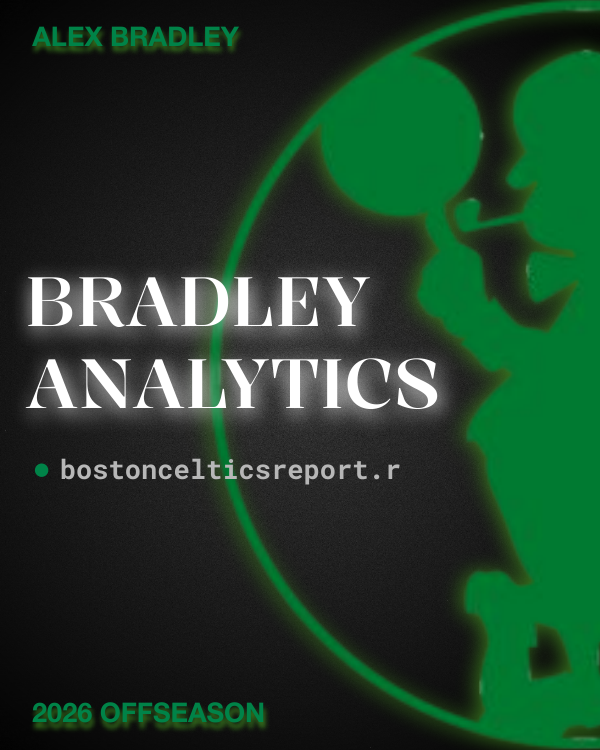
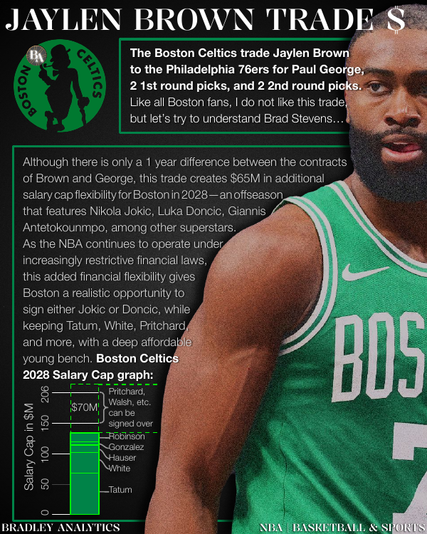
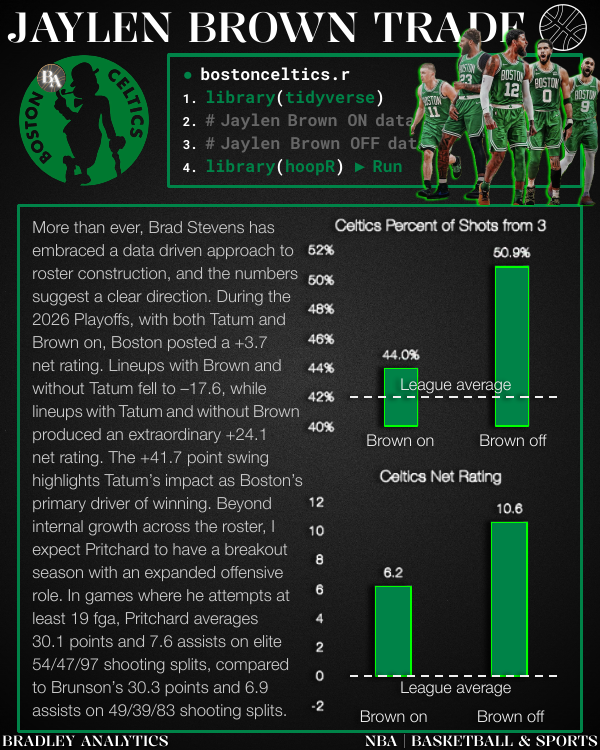
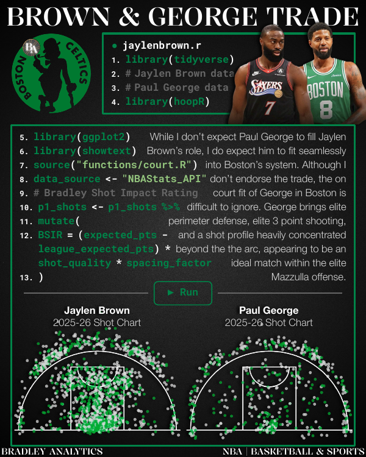
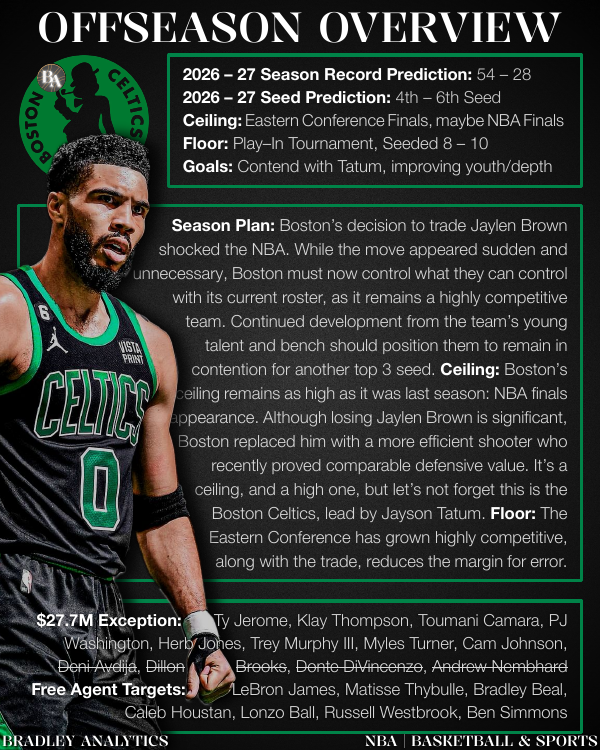
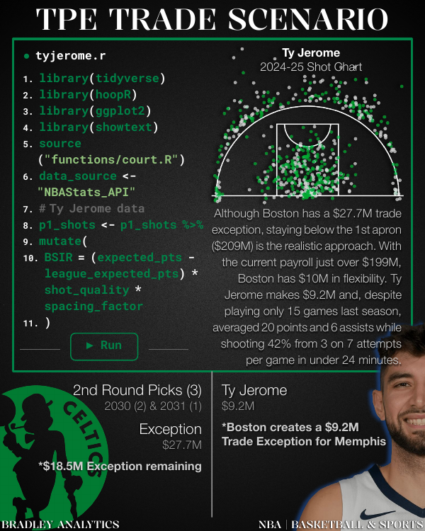
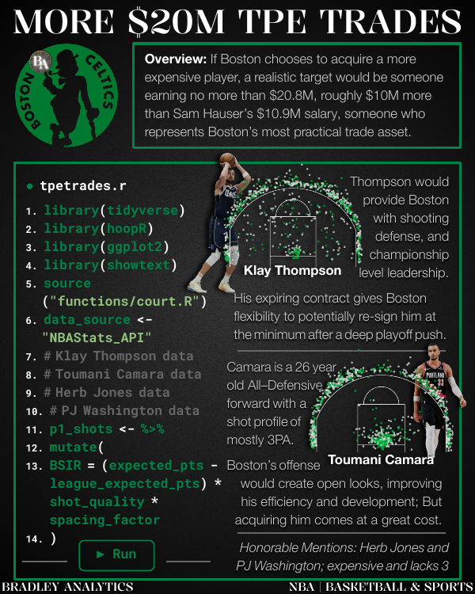
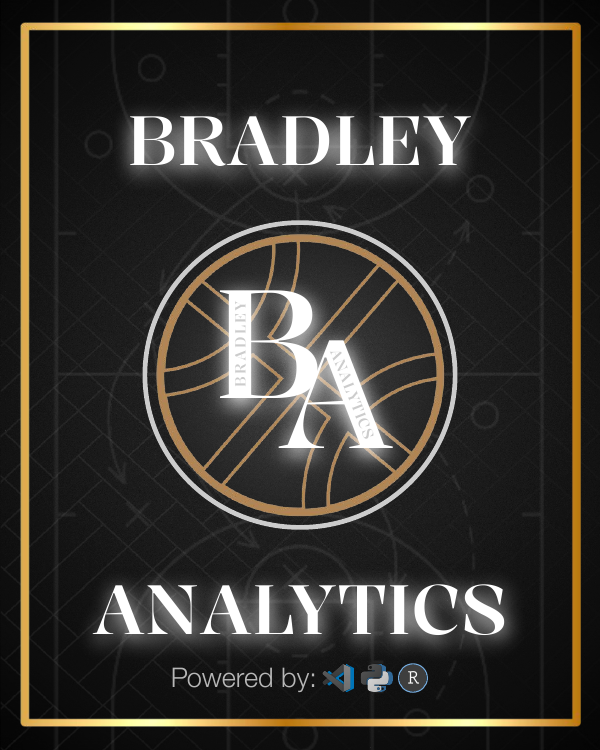

## Results: Boston Celtics Report

One application of the Bradley Analytics Software Engine was the Bradley Analytics Boston Celtics Report July 2026 that was focused on using shot charts to evaluate player tendencies.

The analysis demonstrated how basketball visualizations can help:

- Identify offensive patterns
- Evaluate shot selection
- Communicate player strengths and weaknesses
- Translate NBA data into strategic insights

<strong>1. Front Cover</strong>

 

<strong>2. Jaylen Brown Trade: Cap Flexibility</strong>

 

<strong>3. Jaylen Brown Trade: Net Rating Impact</strong>

 

<strong>4. Jaylen Brown Trade: Shot Chart Comparison</strong>

 

<strong>5. Offseason Overview</strong>

 

<strong>6. Minutes Allocation</strong>

 

<strong>7. The Mazzulla Offense</strong>

 

<strong>8. TPE Trade Scenario: Ty Jerome</strong>

 

<strong>9. More $20M TPE Trades</strong>

 

<strong>10. Back Cover</strong>

 

 

The complete Bradley Analytics Boston Celtics Report is available in the `reports/` folder.

[The Bradley Analytics Book](https://docs.google.com/presentation/d/10oVZkR50QBvXiob5jMWr9oYAMjl61txyJMO19qY-wac/edit?usp=sharing)

---
