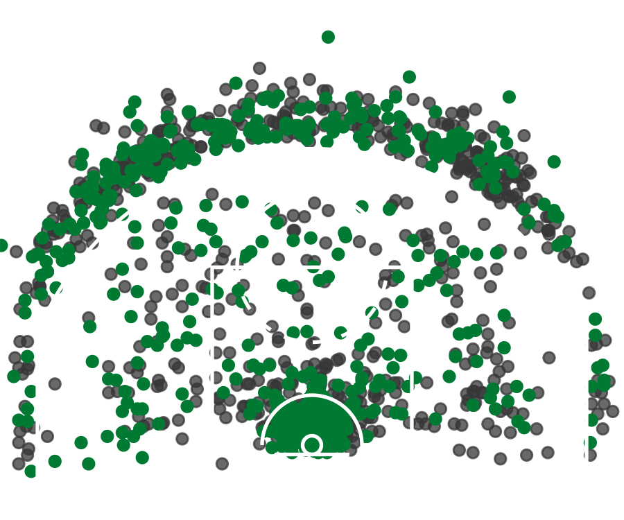
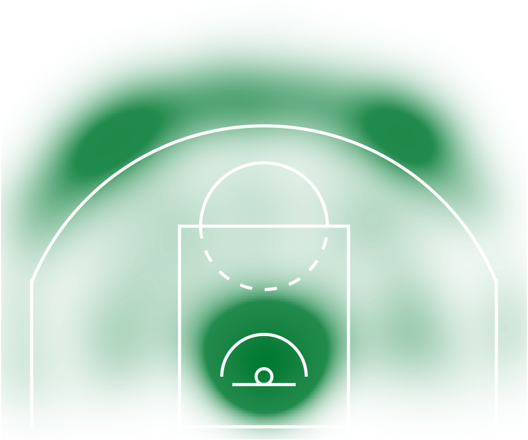

<a id="demo-section"></a>

## Demo


<a id="shot-chart-section"></a>

### Shot Chart Example



<a id="heat-map-section"></a>

### Heat Map Example



<a id="hex-shot-chart-section"></a>

### Hex Shot Chart Example


<a id="bar-chart-section"></a>

### Bar Chart Example


<a id="scatter-plot-section"></a>

### Scatter Plot Example


<a id="animated-shot-chart-section"></a>

### Animated Shot Chart Example


Generated visualizations are automatically saved into:

```
visualizations/
```

Additional basketball analytics reports and presentations can be found in:

```
reports/
```

---
